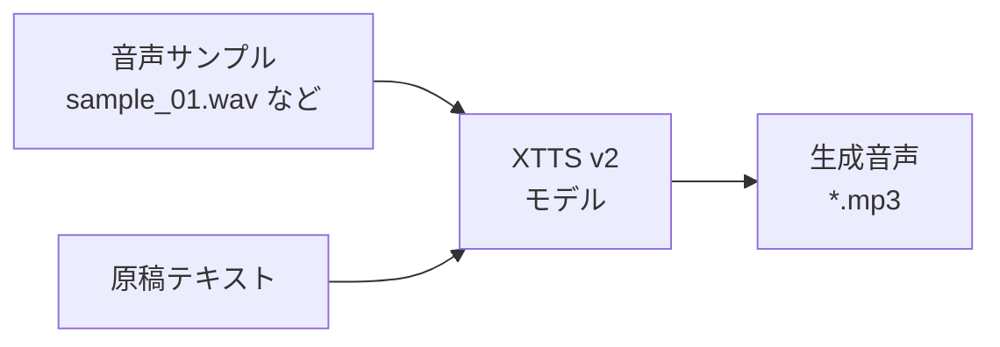
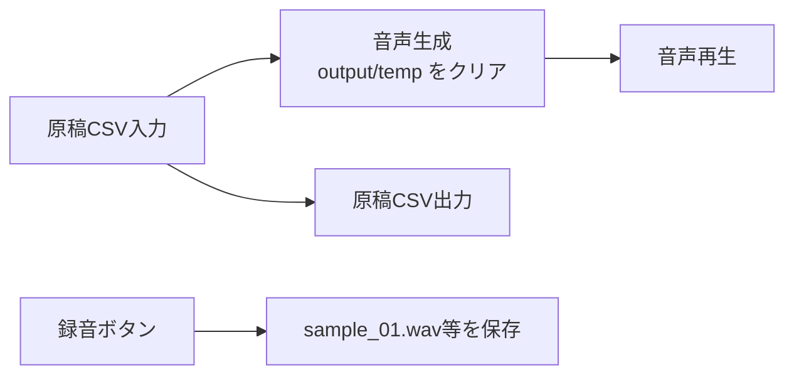

# MyVoice Maker

原稿CSVから、AI音声ナレーション（MP3）を自動生成するツールです。

**バージョン**: 1.0.0  
**日付**: 2026-01-05  
**リポジトリ**: https://github.com/J1921604/MyVoice-Maker

## 🎯 音声生成技術

### Coqui TTS (XTTS v2)

このプロジェクトは **Coqui TTS（XTTS v2）** を使用して、あなた自身の声を使った音声ナレーションを生成します。



#### 特徴

- **自分の声**: 数秒〜数十秒の音声サンプルで、あなたの声を再現（長く録ってもOK）
- **多言語対応**: 日本語を含む複数言語に対応
- **オープンソース**: 完全にオープンソースで、ローカル実行可能
- **高品質**: 自然な抑揚とイントネーションを再現

#### 音声サンプル作成（推奨: Web UI）

`index.html` の「録音」からマイク入力を録音し、サーバーが `src/voice/models/samples/sample_01.wav` のように **上書き禁止**で保存します。

#### 音声サンプル作成（任意: 既存ファイルから変換）

```bash
# 既存の音声ファイル（mp3/wav等）を sample_XX.wav に変換して追加
py -3.10 src\voice\create_voice.py --input path\to\recording.wav
```

生成時は `src/voice/models/samples/` 内の **最大番号の sample_XX.wav** が自動的に選ばれます。

## 📦 機能概要



### 主要機能

| 機能 | 説明 |
|------|------|
| **原稿CSV入力** | inputフォルダにCSVファイルを上書き保存 |
| **録音** | マイクから音声サンプルを録音し、`src/voice/models/samples/sample_XX.wav` に保存（上書き禁止） |
| **音声生成** | Coqui TTS（XTTS v2）でAI音声を生成し、`output/*.mp3` へ上書き保存（生成前に `output/temp` を全削除）。話者埋め込みキャッシュにより高速化。 |
| **音声再生** | 生成された音声を再生 |
| **原稿CSV出力** | 編集した原稿をCSVでダウンロード |

### ログ

実行ログは `logs/app.log` に保存されます。エラー発生時やパフォーマンス確認に利用してください。

特に初回はモデルのダウンロード/初期化に数分かかることがあります。`logs/app.log` に
`[VoiceGenerator] init: loading XTTS model...` が出たまま進まない場合は、この工程で停止しています。

## 🚀 クイックスタート

### 1. 環境準備

```bash
# Python 3.10.11で仮想環境を作成
py -3.10 -m venv .venv
.venv\Scripts\activate

# 依存パッケージをインストール
pip install -r requirements.txt
```

### 2. ワンクリック起動

```powershell
# start.ps1を右クリック→「PowerShellで実行」、または
powershell -ExecutionPolicy Bypass -File start.ps1
```

### 3. 手動でサーバー起動

```bash
py -3.10 -m uvicorn src.server:app --host 127.0.0.1 --port 8000
```

### 4. ブラウザでアクセス

```
http://127.0.0.1:8000
```

### 5. 音声生成手順

1. **原稿CSV読み込み**: 「原稿CSV入力」でCSVを読み込み、input/原稿.csvに上書き保存
2. **音声サンプル録音（初回のみ）**: 「録音」でマイクから3-600秒の音声を録音（録音時間は手動設定可能）
3. **音声生成**: 「音声生成」で `output/temp` をクリアし、音声ファイル（`*.mp3`）を生成（上書き）
4. **音声再生**: 「音声再生」で生成された音声を確認
5. **原稿CSV出力**: 編集した原稿をCSVでダウンロード可能

## 🧯 トラブルシュート（処理中 0/20 で止まる）

UIが「処理中 0/20」のまま進まない場合、サーバー側で **(A) モデル初期化** / **(B) 音声生成** のどちらで止まっているかを
`logs/app.log` で確認してください。

最新版では、サーバーがモデル初期化中の場合 `/api/generate_audio` は 202(warming) を返し、
UIは「モデル初期化中: ...」を表示しながら自動リトライします。

- (A) モデル初期化で停止:
   - `Server: [startup] TTS warmup start...` の後に
   - `VoiceGenerator: [VoiceGenerator] init: loading XTTS model...` が出たまま
   - `... XTTS model ready ...` が出ない
  
   → 初回ダウンロード/初期化中の可能性が高いです（回線・FW/プロキシの影響もあり）。

- (B) 音声生成で停止:
   - `/api/generate_audio start ...` は出るが `/api/generate_audio done ...` が出ない
  
   → 生成処理が詰まっています。`VoiceGenerator` の `Generating WAV...` 以降のログを確認してください。

### 6. タイムアウト対策（XTTS v2初回ロード）

- サーバー起動時にTTSモデルのプリロードを自動実行（環境変数 `SVM_AUTO_WARMUP=0` で無効化）
- UIの各生成リクエストは600秒タイムアウト。初回ロードが長い場合は、先に `/api/warmup_tts` を叩くか、サーバー起動後しばらく待ってから生成を開始すると安定します。

### CLIで直接実行

```bash
# 音声生成テスト
py -3.10 src\voice\voice_generator.py
```

## 📁 ファイル構成

```
MyVoice-Maker/
├── index.html          # WebアプリUI（GitHub Pages静的配信対応）
├── start.ps1           # ワンクリック起動スクリプト
├── requirements.txt    # Python依存パッケージ
├── pytest.ini          # pytest設定
├── input/
│   └── 原稿.csv        # ナレーション原稿
├── output/
│   └── temp/           # 一時ファイル（中間生成物）
├── src/
│   ├── main.py         # CLIエントリポイント
│   ├── server.py       # FastAPIサーバー
│   └── voice/
│       ├── create_voice.py      # 既存音声→sample_XX.wav 変換ユーティリティ
│       ├── voice_generator.py   # 音声生成クラス
│       └── models/samples/      # 音声サンプル保存先
├── tests/
│   └── e2e/            # E2Eテスト
├── docs/               # ドキュメント
└── specs/              # 仕様書
```

## 📝 原稿CSV形式

```csv
index,script
0,"最初の原稿テキストをここに記載します。"
1,"2番目の原稿です。複数行も可能です。"
2,"3番目の原稿。"
```

- **index**: 行番号（0から開始）
- **script**: 読み上げ原稿テキスト
- **文字コード**: UTF-8（BOM付き推奨）、Shift_JIS、EUC-JP対応

## ⚙️ 環境変数設定

音声生成のパラメータを環境変数で調整できます：

| 変数名 | デフォルト | 説明 |
|--------|-----------|------|
| `COQUI_SPEAKER_WAV` | （自動選択） | 話者サンプル音声パス（相対パスはリポジトリルート基準） |
| `SVM_INPUT_DIR` | `input/` | 入力フォルダ（テスト用に差し替え可能） |
| `SVM_OUTPUT_DIR` | `output/` | 出力フォルダ（テスト用に差し替え可能） |
| `SVM_FAKE_TTS` | `0` | `1`でフェイクTTS（モデルDL無しで無音MP3生成、CI/e2e向け） |

## ✅ テスト

```bash
# E2Eテスト
py -3.10 -m pytest -m e2e -v

# バックエンドE2Eテスト
py -3.10 -m pytest tests/e2e/test_local_backend.py -v
```

## トラブルシューティング

### 文字化けする場合

原稿CSVをUTF-8（BOM付き）で保存してください。メモ帳の場合：
- 「名前を付けて保存」→ 文字コード: `UTF-8 (BOM付き)`

### FFmpegエラー

imageio-ffmpegが自動でFFmpegをダウンロードしますが、問題がある場合：

```bash
pip install --upgrade imageio-ffmpeg
```

### 音声が生成されない / タイムアウトエラー

**初回実行時の注意**: Coqui TTS (XTTS v2)モデルのダウンロードとロードに2-3分かかります。

**症状**: 「音声生成失敗: タイムアウト」エラー

**対策**:
1. **サーバーが起動しているか確認**:
   ```powershell
   # ポート8000を確認
   netstat -ano | findstr :8000
   
   # サーバーヘルスチェック
   Invoke-WebRequest -Uri "http://127.0.0.1:8000/api/health"
   ```

2. **初回は10分程度待つ**: モデルダウンロードとロードに時間がかかります
   - ブラウザのコンソール（F12）で進捗を確認できます
   - `[fetchJson] リクエスト開始` と表示されていれば処理中です

3. **音声サンプルファイルを確認**:
   ```bash
   # ファイルが存在するか確認
   Test-Path src\voice\models\samples\sample_01.wav
   
   # 存在しない場合はWeb UIで録音して保存
   ```

4. **サーバーを再起動**:
   ```powershell
   # start.ps1で再起動
   powershell -ExecutionPolicy Bypass -File start.ps1
   ```

### バックエンドが検出されない

サーバーを起動してください：

```powershell
# ワンクリック起動
powershell -ExecutionPolicy Bypass -File start.ps1

# または手動起動
py -3.10 -m uvicorn src.server:app --host 127.0.0.1 --port 8000
```

### `index.html` を `file://` で開くと動かない

`file://` 直開きだと `window.location.origin` が `null` になり、API URL が壊れてUIが無反応に見える場合があります。

- 推奨: `start.ps1` でサーバーを起動し、 `http://127.0.0.1:8000` からアクセスしてください。
- どうしても `file://` で開く場合: UIは `http://127.0.0.1:8000` をフォールバック先として扱います（サーバー起動が前提）。

## 📚 ドキュメント

| ドキュメント | 説明 |
|-------------|------|
| [完全仕様書](https://github.com/J1921604/MyVoice-Maker/blob/main/docs/完全仕様書.md) | 詳細な機能仕様 |
| [spec.md](https://github.com/J1921604/MyVoice-Maker/blob/main/specs/001-MyVoice-Maker/spec.md) | 機能仕様書 |
| [plan.md](https://github.com/J1921604/MyVoice-Maker/blob/main/specs/001-MyVoice-Maker/plan.md) | 実装計画 |
| [tasks.md](https://github.com/J1921604/MyVoice-Maker/blob/main/specs/001-MyVoice-Maker/tasks.md) | タスク一覧 |

## 🌐 GitHub Pages（静的UI）

Actionsが静的な `index.html` をGitHub Pagesで公開します。バックエンドAPIはローカルサーバー（`start.ps1` / `py -3.10 -m uvicorn src.server:app`）で動かしてください。

手動でPages用アーティファクトを作る場合:

```bash
mkdir -p dist
cp index.html dist/
cp -r docs dist/docs
cp -r specs dist/specs
cp README.md dist/README.md
```

その後、`actions/upload-pages-artifact` と `actions/deploy-pages` で公開されます（`.github/workflows/pages.yml` 参照）。

## 📄 ライセンス

MIT License

## 🙏 クレジット

- [Coqui TTS](https://github.com/coqui-ai/TTS) - オープンソース音声合成（XTTS v2モデル使用）
- [FastAPI](https://fastapi.tiangolo.com/) - Webフレームワーク
