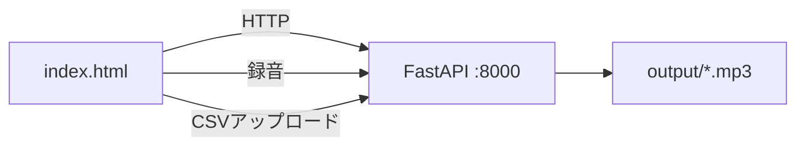

# デプロイ/起動ガイド（音声生成: MP3）

このプロジェクトは、**原稿CSV（index,script）** と **話者音声サンプル** を使って、
Coqui TTS（XTTS v2）で **MP3 音声** を生成するローカルアプリです。

**バージョン**: 1.0.0  
**日付**: 2026-01-05  
**リポジトリ**: https://github.com/J1921604/MyVoice-Maker

## アーキテクチャ概要

- フロントエンド: 静的 `index.html`
- バックエンド: ローカル FastAPI（`src/server.py`）
- 音声生成: Coqui TTS（XTTS v2）
- 出力: `output/voice_000.mp3` など（index に対応したファイル名）



## ローカルバックエンド起動

### 前提条件

- Windows
- Python 3.10.11

### ワンクリック（推奨）

`start.ps1` を実行します。

### 手動起動

```powershell
py -3.10 -m uvicorn src.server:app --host 127.0.0.1 --port 8000
```

起動後、ブラウザで以下へアクセスします。

```
http://127.0.0.1:8000
```

## Web UI の操作手順

1. **原稿CSV入力**: CSV をアップロード
2. **録音**: 話者音声サンプルを保存（`src/voice/models/samples/sample_XX.wav`）
3. **音声生成モデル構築**: 話者埋め込み（voiceキャッシュ）を作成・保存
4. **音声生成**: `output/temp` を全削除してから MP3 を上書き生成
5. **音声再生**: 行ごとに「音声再生」ボタンで確認

## 環境変数

| 変数 | 既定値 | 説明 |
|---|---|---|
| `COQUI_SPEAKER_WAV` | （自動選択） | 話者サンプル音声パス（相対パスはリポジトリルート基準） |
| `SVM_INPUT_DIR` | `input/` | 入力フォルダ（テスト用に差し替え可能） |
| `SVM_OUTPUT_DIR` | `output/` | 出力フォルダ（テスト用に差し替え可能） |
| `SVM_FAKE_TTS` | `0` | `1`でフェイクTTS（CI/e2e向け） |
| `SVM_AUTO_WARMUP` | `1` | `0`で起動時プリロード無効 |

## よくある質問

- **初回だけ遅い**: 初回はモデルのダウンロード/ロードが走るため時間がかかります。サーバー起動後しばらく待つか、`/api/warmup_tts` を先に実行してください。
- **上書きに失敗する**: 再生中の音声があると Windows でロックされることがあります。生成前にプレイヤーを停止すると改善します。

