# データモデル: MyVoice Maker

**日付**: 2026-01-05
**Phase**: 1 - 設計

## 概要

本ドキュメントは、MyVoice Maker（音声生成専用）のデータモデルを定義する。

## エンティティ関係図


## エンティティ定義

### ScriptEntry（原稿エントリ）

CSVの1行に対応する原稿データ。

| 属性 | 型 | 説明 | 制約 |
|------|-----|------|------|
| index | int | 連番（0始まり） | 0以上 |
| script | string | 読み上げテキスト | 空文字可 |

**CSV形式**:

```csv
index,script
0,"最初の原稿テキスト"
1,"2行目の原稿"
```

---

### SpeakerSample（話者サンプル）

自分の声を再現するための参照音声。

| 属性 | 型 | 説明 | 制約 |
|------|-----|------|------|
| path | string | ファイルパス | `src/voice/models/samples/sample_01.wav` など |
| created_at | string | 作成時刻（任意） | UI/サーバー実装次第 |

**運用**:

- 連番ファイル（`sample_01.wav`, `sample_02.wav` ...）として保存し、既存ファイルは上書きしない。
- 既定の話者サンプルは「最大番号（最新）」を自動選択する。

---

### VoiceOutput（生成音声）

原稿エントリから生成されるMP3。

| 属性 | 型 | 説明 | 制約 |
|------|-----|------|------|
| index | int | 連番（0始まり） | `ScriptEntry.index` と一致 |
| path | string | 出力ファイルパス | `output/slide_000.mp3` など |
| text | string | 元の原稿テキスト | 参照用 |

---

### TempFolder（一時フォルダ）

中間生成物（WAVなど）を格納するフォルダ。

| 属性 | 型 | 説明 | 制約 |
|------|-----|------|------|
| path | string | フォルダパス | `output/temp/` |
| auto_clear_on_start | bool | 開始時自動クリア | 常にTrue |
| max_retries | int | 削除リトライ回数 | 3（目安） |

**状態遷移**:

```mermaid
stateDiagram-v2
    [*] --> 存在しない: 初回実行
    存在しない --> 作成済: os.makedirs()

    作成済 --> ファイル有: 処理実行
    ファイル有 --> 削除中: clear_temp_folder()
    削除中 --> 作成済: shutil.rmtree() + os.makedirs()

    削除中 --> ロック中: PermissionError
    ロック中 --> 作成済: リトライ後に続行
```



## 処理フロー


## バリデーションルール

### 原稿テキストバリデーション

```python
def validate_script_text(text: str) -> str:
    """空文字や空白のみの場合は空文字を返す"""
    if text is None:
        return ""
    return text.strip()
```
