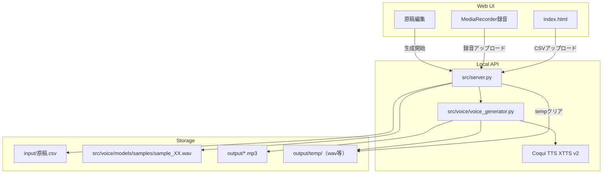
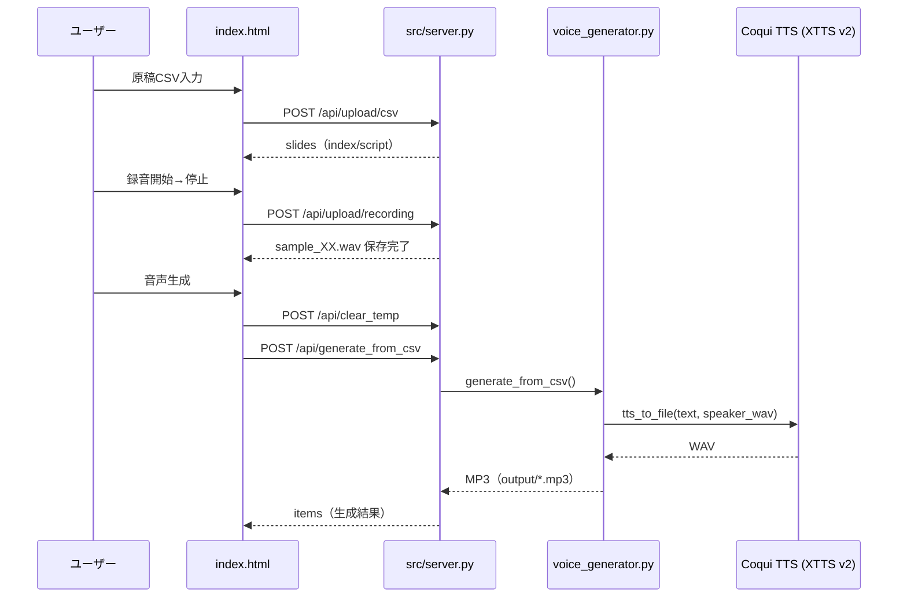
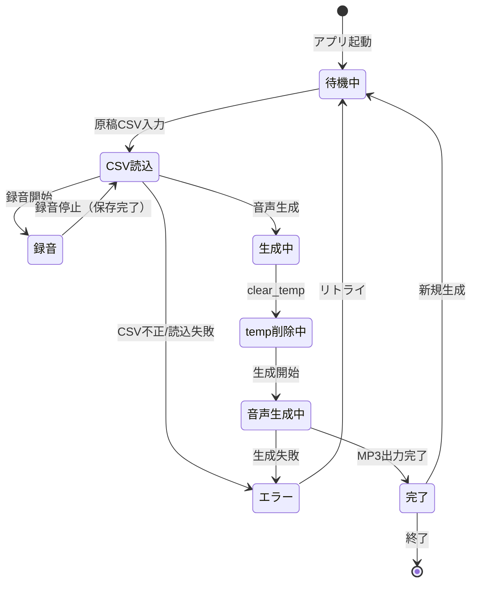

# 実装計画: MyVoice Maker

**ブランチ**: `001-MyVoice-Maker`
**日付**: 2026-1-5
**リポジトリ**: https://github.com/J1921604/MyVoice-Maker
**仕様**: https://github.com/J1921604/MyVoice-Maker/blob/main/specs/001-MyVoice-Maker/spec.md

## 概要

本計画は、MyVoice Makerツールに以下の機能を追加するための実装計画である:

1. **音声サンプル録音機能**: 3-600秒の手動録音時間設定
2. **原稿CSV入力機能**: UTF-8/Shift-JIS対応のCSVアップロード
3. **音声生成機能**: Coqui TTS (XTTS v2)による自分の声での音声生成
4. **temp上書き更新機能**: 毎回のビルド時にtempフォルダをクリア（リトライ機能付き）
5. **タイムアウト対策**: 初回XTTSモデルロードを考慮した600秒タイムアウト設定

加えて、運用上の要件として以下も満たす:

- 原稿CSV入力でinput/原稿.csv上書き、音声生成でCoqui TTS実行、output/tempにmp3出力
- **Web UIはサーバー連携のみ（静的配信はGitHub Pages、APIはローカル）**
- **録音ファイルをsrc/voice/models/samples/に保存**
- **CSV読み込み時のエンコーディングエラーを回避**（UTF-8/Shift-JIS自動判定）
- 変更内容を **E2Eテストへ反映**し、検証可能にする

## 技術コンテキスト

**言語/バージョン**: Python 3.10.11
**主要依存関係**: TTS (Coqui XTTS v2), soundfile, imageio-ffmpeg, fastapi, uvicorn, torch, torchaudio, cutlet, unidic-lite
**ストレージ**: ファイルシステム（output/temp/, src/voice/models/samples/）
**テスト**: 手動テスト + E2Eスクリプト
**ターゲットプラットフォーム**: Windows
**プロジェクト種別**: single（Python CLI + Web UI）
**パフォーマンス目標**: 1行あたり30秒以内で音声生成
**制約**: UTF-8エンコーディング必須、メモリ使用量はテキストサイズの10倍以内
**規模/スコープ**: 個人/小規模チーム向け、1～100行のCSV対応

## 憲法チェック

| 原則 | 確認項目 | 状態 |
|------|----------|------|
| I. テスト駆動開発 | テスト作成計画が含まれているか | ✅ |
| II. セキュリティ最優先 | セキュリティ要件が機能要件より優先されているか | ✅ |
| III. パフォーマンス基準 | 定量的なパフォーマンス目標が定義されているか | ✅ |
| IV. 品質と一貫性 | UTF-8エンコーディング、依存バージョン固定が確認されているか | ✅ |
| V. シンプルさの追求 | YAGNI原則に従い、複雑さの正当化が必要か | ✅ |

**制約確認**:

- [x] 機密データの平文保存がないこと
- [x] 外部依存がバージョン固定されていること
- [x] 仕様と実装の乖離がレビューで検知可能であること

## プロジェクト構造

### ドキュメント（本機能）

```text
specs/001-MyVoice-Maker/
├── spec.md              # 機能仕様書
├── plan.md              # 本ファイル（実装計画）
├── tasks.md             # タスク一覧
├── research.md          # 調査結果（Phase 0出力）
├── data-model.md        # データモデル（Phase 1出力）
├── quickstart.md        # クイックスタート（Phase 1出力）
└── contracts/           # API契約（Phase 1出力）
```

### ソースコード（リポジトリルート）

```text
MyVoice-Maker/
├── index.html           # Web UI（サーバー連携、GitHub Pages静的配信）
├── start.ps1            # ワンクリック起動スクリプト
├── requirements.txt     # Python依存パッケージ
├── input/
│   └── 原稿.csv         # 読み上げ原稿
├── output/
│   ├── *.mp3            # 生成された音声（上書き）
│   └── temp/            # 中間生成物（wav等、自動クリア対象）
├── src/
│   ├── main.py          # CLIエントリポイント
│   └── server.py        # FastAPIサーバー
└── tests/
    └── e2e/
        ├── test_resolution.py      # CLI E2Eテスト
        └── test_local_backend.py   # バックエンドE2Eテスト

pytest.ini               # pytest設定（markers等）
```

## 実装アーキテクチャ



## データフロー



## 状態遷移



## 複雑さの追跡

本実装は既存コードへの最小限の変更で実現するため、追加の複雑さはない。

| 項目 | 判定 |
|------|------|
| 新規パターン導入 | なし |
| 外部依存追加 | なし（shutil標準ライブラリのみ） |
| アーキテクチャ変更 | なし |

## Phase 0: 調査

### 解決済み事項

| 項目 | 決定 | 根拠 |
|------|------|------|
| temp削除方式 | shutil.rmtree() + リトライ | Windowsのロックを考慮 |
| UI実装 | Vanilla JS | 単一 `index.html` で完結 |
| 録音保存 | MediaRecorder → サーバーでWAV変換 | ブラウザ差異を吸収 |

### 調査結果

- CSVは UTF-8(BOM) / CP932(Shift_JIS) / EUC-JP 等が混在し得るため、サーバー側でスコアリング復号を行う
- Windows環境ではファイルロックが起きやすいため、temp削除とMP3上書きはリトライ/置換で堅牢化する
- 初回のXTTSモデルロードは重く、UI側は最大600秒の待機を前提にする

## Phase 1: 設計

### temp上書き機能

**src/server.py**:
- `clear_temp_folder(temp_dir)` 関数追加
- `shutil.rmtree()` でフォルダ削除
- `os.makedirs()` で再作成
- ファイルロック時のエラーハンドリング

## Phase 2: 実装

タスク詳細は https://github.com/J1921604/MyVoice-Maker/blob/main/specs/001-MyVoice-Maker/tasks.md を参照。

## 検証計画

| テスト種別 | 内容 | 担当 |
|------------|------|------|
| 単体テスト | CSVデコード/話者サンプル選択 | 自動 |
| CLI E2Eテスト | 原稿CSV→MP3生成 | 自動 |
| バックエンドE2Eテスト | サーバー経由でCSVアップロード→MP3生成 | 自動 |
| 回帰テスト | Web UI: CSV→録音→生成→再生 | 手動 |

## リスクと対策

| リスク | 影響度 | 対策 |
|--------|--------|------|
| tempファイルロック | 低 | エラーログ出力して続行 |
| ブラウザ互換性 | 低 | Chrome/Edge最新版を推奨 |
