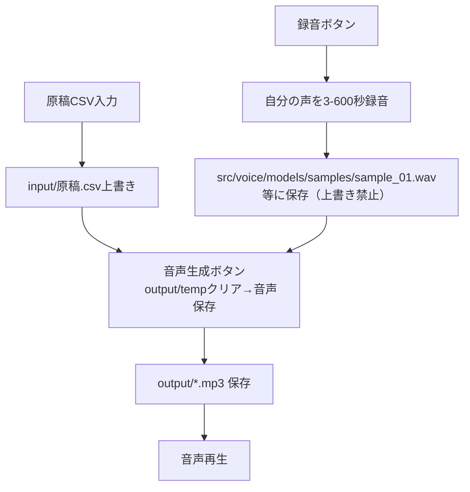
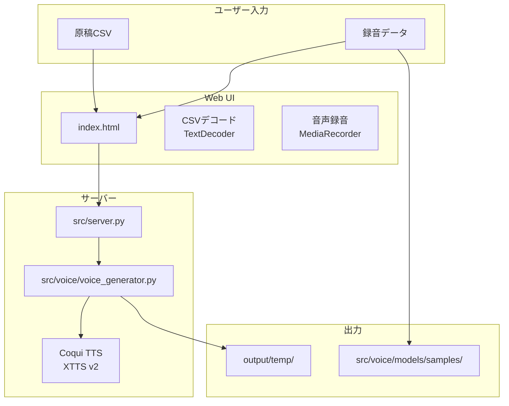
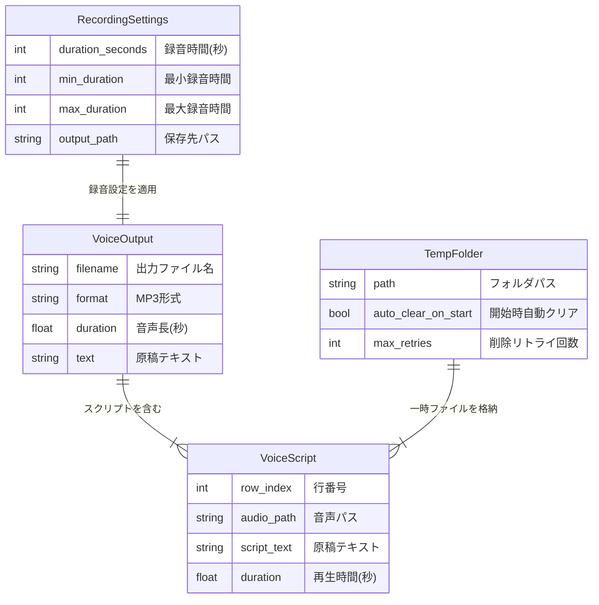

# 機能仕様書: MyVoice Maker

**機能ブランチ**: `001-MyVoice-Maker`
**作成日**: 2026-01-05
**バージョン**: 1.0.0
**状態**: 承認済
**リポジトリ**: https://github.com/J1921604/MyVoice-Maker

## 概要

MyVoice Makerは、原稿CSVから、**Coqui TTS (XTTS v2)** を使用した自分の声によるAI音声ナレーション（MP3）を自動生成するツールである。

本仕様では以下の機能を定義する:

1. **音声サンプル録音**: 自分の声を3-600秒間録音し、話者サンプルとして保存
2. **原稿CSV入力**: CSVファイルをアップロードし、各行のテキストを音声化
3. **音声生成**: Coqui TTSを使用して自然な日本語音声を生成
   - **高速化**: 話者埋め込み（latents）をキャッシュし、2回目以降の生成を高速化
   - **ログ保存**: 処理詳細やエラーを `logs/app.log` に記録
    - **初回注意**: 初回のみモデルDL/初期化が長時間になることがある（ログで段階を追跡可能）
4. **temp上書き更新**: 毎回の実行時にoutput/tempフォルダをクリアし、中間生成物（WAV等）を残さない

加えて、運用上の必須要件として以下を定義する:

- **機能（src/server.py起動時）**:
  - 原稿CSV入力ボタン実行で、inputフォルダにCSVファイルを毎回上書き保存
    - 録音ボタンで自分の声を録音（3-600秒間の手動設定可能）
  - 音声生成ボタン実行で、output/tempフォルダをクリアして音声ファイルを保存
  - 原稿CSV出力ボタン実行で、編集した原稿をCSVでダウンロード
  - 音声出力ボタン実行で、outputフォルダに保存した音声ファイル（MP3）を選択してダウンロード

## プロセスフロー



## システムアーキテクチャ



### ユーザーストーリー1 - 音声サンプル録音（優先度: P1）

ユーザーは自分の声を3-600秒間録音し、話者サンプルとして保存できる。

**この優先度の理由**: Coqui TTSで自分の声を再現するために必須の機能のため、最優先で実装する。

**独立テスト**: 録音ボタンで10秒間録音し、src/voice/models/samples/にWAVファイルが保存されることを確認する。
（注: ブラウザ録音の形式は環境依存のため、サーバー側でPCM WAVに変換し、最終的に `sample_01.wav` 等として保存されること）

**受入シナリオ**:

| 前提条件 | 操作 | 期待結果 |
|----------|------|----------|
| マイクが接続されている | 録音時間を30秒に設定して録音 | 30秒の音声サンプルが保存される |
| 録音時間未設定 | 録音ボタンをクリック | デフォルト10秒で録音される |

---

### ユーザーストーリー2 - 音声生成とタイムアウト対策（優先度: P1）

ユーザーは原稿CSVから音声を生成でき、初回のXTTSモデルロードを考慮してもタイムアウトせずに完了できる。

**この優先度の理由**: 長文音声生成時のタイムアウトエラーを防ぐため最優先。

**独立テスト**: 原稿CSVをアップロードし、音声生成が完了して `output/*.mp3` が生成されることを確認する。

**受入シナリオ**:

| 前提条件 | 操作 | 期待結果 |
|----------|------|----------|
| 初回起動直後（モデル未ロード） | 音声生成を実行 | 初回ロードを含めてもタイムアウトせず生成完了（UIは最大600秒待機） |
| 通常の原稿CSV | 音声生成を実行 | 各行が個別のMP3ファイルとして生成される |

---

### ユーザーストーリー3 - temp上書き更新（優先度: P1）

ユーザーは毎回の実行時にtempフォルダが自動的にクリアされ、古いファイルが残らない。

**この優先度の理由**: ディスク容量の圧迫防止と、混乱の原因となる古いファイルの除去のため最優先。

**独立テスト**: 2回連続で音声生成を実行し、tempフォルダ内に1回目のファイルが残っていないことを確認する。

**受入シナリオ**:

| 前提条件 | 操作 | 期待結果 |
|----------|------|----------|
| tempフォルダに過去の音声ファイルがある | 新しいCSVで音声生成 | 過去のファイルは削除され新しいファイルのみ存在 |
| tempフォルダが存在しない | 音声生成を実行 | tempフォルダが作成されファイルが生成される |

---

### エッジケース

- 録音時間が範囲外（3秒未満、600秒超）の場合、デフォルト10秒にフォールバック
- tempフォルダ削除中にファイルがロックされている場合、エラーログを出力して続行（最大3回リトライ）
- CSV読み込み時にUTF-8とShift-JISの両方で試行し、エンコーディングエラーを回避
- マイクアクセスが拒否された場合、エラーメッセージを表示

## 機能要件

| ID | 要件 | 優先度 |
|----|------|--------|
| FR-001 | システムは3-600秒の録音時間設定を提供しなければならない | P1 |
| FR-002 | システムはデフォルト録音時間として10秒を使用しなければならない | P1 |
| FR-003 | システムは音声生成前にtempフォルダを自動的にクリアしなければならない | P1 |
| FR-004 | システムは録音ファイルをsrc/voice/models/samples/に保存しなければならない | P1 |
| FR-005 | システムはindex.html（Web UI）に録音時間入力UIを追加しなければならない | P1 |
| FR-006 | システムはUTF-8エンコーディングで全ファイルを処理しなければならない | P1 |
| FR-007 | システムは音声形式としてWAV（録音）とMP3（生成）をサポートしなければならない | P1 |
| FR-008 | システムは原稿CSVをinput/原稿.csvに上書き保存しなければならない | P1 |
| FR-009 | システムは音声生成のタイムアウトを600秒に設定しなければならない（初回のXTTSロードを考慮） | P1 |
| FR-011 | システムはCoqui TTS (XTTS v2)を使用して音声を生成しなければならない | P1 |
| FR-012 | システムはCSV読み込み時にUTF-8とShift-JISのエンコーディングをサポートしなければならない | P1 |

## 主要エンティティ



## 成功基準

| ID | 基準 | 測定方法 |
|----|------|----------|
| SC-001 | 音声生成が1行あたり30秒以内に完了する | 処理時間計測 |
| SC-002 | temp上書きによりディスク使用量が前回生成分のみに制限される | ファイルサイズ確認 |
| SC-003 | 録音時間設定と実際の録音時間が±1秒以内で一致する | 録音ファイル長確認 |
| SC-004 | Web UIで録音とCSV入力が正常に動作する | E2Eテスト |
| SC-005 | 500文字以上の長文が自動分割され、タイムアウトなく生成される | 長文テスト |

## 技術スタック

| 項目 | 技術 |
|------|------|
| 言語 | Python 3.10.11 |
| 音声合成 | Coqui TTS (XTTS v2) - 自分の声でクローン音声生成 |
| 音声処理 | soundfile |
| Web UI | Pure HTML/CSS/JavaScript |
| サーバー | FastAPI + Uvicorn |

## 依存関係

```
# 音声合成
TTS>=0.22.0                 # Coqui TTS (XTTS v2)
torch>=2.0.0                # PyTorch (Coqui TTS依存)
torchaudio>=2.0.0           # torchaudio (Coqui TTS依存)
soundfile>=0.12.1           # 音声ファイル処理
cutlet>=0.4.0               # 日本語ローマ字化
unidic-lite>=1.0.8          # MeCab辞書（fugashi依存）

# Webサーバー
fastapi>=0.104.0            # REST API
uvicorn[standard]>=0.24.0   # ASGIサーバー

# ユーティリティ
requests>=2.31.0            # HTTP通信
pytest>=7.4.0               # テスト
```
