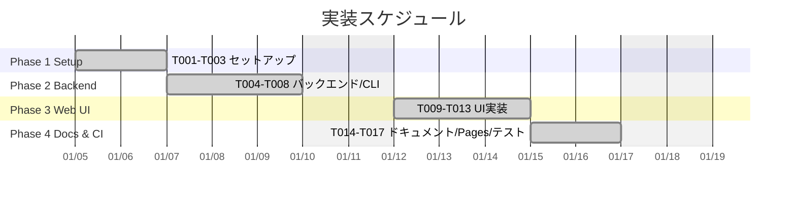
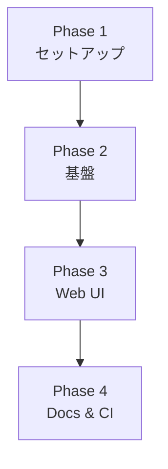

# タスク一覧: MyVoice Maker

**入力**: `/specs/001-MyVoice-Maker/` からの設計ドキュメント
**前提条件**: plan.md（必須）、spec.md（必須）、data-model.md、contracts/
**バージョン**: 1.0.0
**開始日**: 2026-1-5
**リポジトリ**: https://github.com/J1921604/MyVoice-Maker

## 形式: `[ID] [P?] [ストーリー?] 説明`

- **[P]**: 並列実行可能（異なるファイル、依存関係なし）
- **[US1]**: ユーザーストーリー1（音声サンプル録音）
- **[US2]**: ユーザーストーリー2（音声生成とタイムアウト対策）
- **[US3]**: ユーザーストーリー3（temp上書き更新）

---

## 実装スケジュール



**注意**: 
- 基準開始日: 2026-1-5
- 休日除外: 土日・年末年始（12/27-1/4）
- 相対日付: `after`キーワードで自動調整
- 基準日変更時: 最初のタスク日付を変更すれば全体が調整されます

---

## Phase 1: セットアップ

**目的**: プロジェクト構造確認と仕様ドキュメント作成

- [x] T001 specs/001-MyVoice-Maker/フォルダを作成
- [x] T002 [P] spec.md（機能仕様書）を作成
- [x] T003 [P] plan.md（実装計画）を作成

**チェックポイント**: ドキュメント準備完了 ✅

---

## Phase 2: バックエンド/CLI

**目的**: CSV保存・録音保存・音声生成（上書き）をAPI/CLIで成立させる

- [x] T004 [P] `POST /api/upload/csv` で `input/` に保存し、パース結果（slides）を返す
- [x] T005 [P] `POST /api/upload/recording` で `sample_XX.wav` を上書き禁止で保存
- [x] T006 [P] `POST /api/clear_temp` / `POST /api/generate_from_csv` で `output/temp` を事前全削除
- [x] T007 [P] MP3上書き保存の堅牢化（テンポラリ生成→置換、Windowsロック考慮）
- [x] T008 [P] CLI（`src/main.py`）を `python src/main.py ...` でも動作するよう import を安定化

---

## Phase 3: Web UI

**目的**: ワンクリックで「CSV→録音→生成→再生」が成立するUI

- [x] T009 ダーク（黒×オレンジ）基調UI、左サイドバー（CSV入力/録音/生成/CSV出力）
- [x] T010 CSV読み込み後に原稿リストを描画（`renderSlides` 実装）し、編集を状態に反映
- [x] T011 原稿が空（全行空白）なら生成を開始せずエラー表示
- [x] T012 録音UI（録音時間3-600秒、録音中/停止、全/経過/残の表示、停止で保存）
- [x] T013 原稿CSV出力（編集内容をCSVでダウンロード）

---

## Phase 4: Docs & CI

**目的**: ドキュメント整合、GitHub Pages、テスト完走

- [x] T014 [P] README.md を現行仕様（音声生成専用）に整合
- [x] T015 [P] docs/（完全仕様書・デプロイ・FFmpeg手順）を音声生成専用に整合
- [x] T016 [P] GitHub Pages デプロイ（`.github/workflows/pages.yml`）を追加
- [x] T017 unit + e2e テストを実行し 100% 成功を確認

---

## 依存関係と実行順序

### フェーズ依存関係



### ユーザーストーリー依存関係

- **ユーザーストーリー1（P1）**: 基盤（Phase 2）完了後に開始可能 - 他のストーリーへの依存なし
- **ユーザーストーリー2（P1）**: 基盤（Phase 2）完了後に開始可能 - US1とは独立

### 並列実行可能タスク

| Phase | 並列実行可能タスク |
|-------|-------------------|
| Phase 1 | T002, T003 |
| Phase 2 | T004-T007 |
| Phase 3 | T009-T013 |
| Phase 4 | T014-T016 |

---

## 並列例: 基盤完了後

```bash
# 基盤（Phase 1）完了後、backendとUIを並列で進められる例:
チームA: "Phase 2 バックエンド/CLI"
チームB: "Phase 3 Web UI"
```

---

## 実装戦略

### MVP優先（ユーザーストーリー1のみ）

1. Phase 1: セットアップを完了 ✅
2. Phase 2: バックエンド/CLIを完了 ✅
3. Phase 3: Web UIを完了 ✅
4. Phase 4: Docs & CIを完了 ✅
5. 準備ができたらデプロイ/デモ

### インクリメンタルデリバリー

1. セットアップ + 基盤を完了 → 基盤準備完了 ✅
2. バックエンドを追加 → E2Eで検証 → デプロイ/デモ ✅
3. Web UIを追加 → 手動操作で検証 → デプロイ/デモ ✅
4. ドキュメント/Pages/テスト整備 → 公開/配布 ✅

---

## タスク進捗サマリー

| 項目 | 数値 |
|------|------|
| 総タスク数 | 17 |
| 完了 | 17 |
| 未着手 | 0 |

---

## 注意事項

- Python 3.10.11を使用（`py -3.10`）
- UTF-8エンコーディング必須
- 土日・年末年始（12/27-1/4）はスケジュール対象外
- 各チェックポイントで動作確認を実施
- [P] タスク = 異なるファイル、依存関係なし
- [US*] ラベルはトレーサビリティのためタスクを特定のユーザーストーリーにマップ

## 完了条件

1. すべてのタスクが完了状態になっていること
2. unitテストが成功すること（`py -3.10 -m pytest -m "not e2e"`）
3. e2eテストが成功すること（`py -3.10 -m pytest -m e2e`）
4. Web UI で CSV入力→録音→生成→再生 が成立すること
